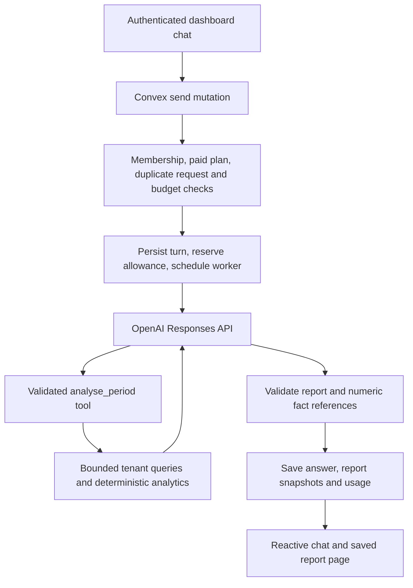

# Business assistant

Authorized on 16 September 2026 as a read-only Pro feature for beauty studio owners and managers. The dashboard entry is `/beauty/assistant`. This is separate from the dormant customer-facing AI front desk.

## Runtime



The model chooses supported metrics, periods, grouping and exact staff/service names. It cannot run SQL or code, retrieve arbitrary records, or invoke booking/customer/message mutations. Convex performs all calculations. A vector database, document embeddings, fine tuning and recursive agents are unnecessary for these structured booking questions.

`convex/analyst/data.ts` and `metrics.ts` also supply the dashboard staff-capacity widget. The older dashboard's separate revenue charts retain their existing definitions; they are not presented as equivalent to the assistant's completed-value reports.

## Configuration

Set these **on the target Convex deployment**, using its environment-variable settings:

- `BUSINESS_ANALYST_OPENAI_API_KEY`: an OpenAI project API key with access to the selected models.
- `BUSINESS_ANALYST_ENABLED`: `true` when the deployment is ready for use; absent or `false` blocks new requests and further provider calls.

The example environment file defaults to disabled. A Next.js environment variable alone does not configure Convex. Never expose the key using `NEXT_PUBLIC_`. Use a dedicated provider project with a billing limit/alert appropriate to the total number of subscribed studios.

The separate key intentionally does not enable the existing marketplace embedding code that reads `OPENAI_API_KEY`. Deploy the dashboard and the Convex schema/functions together. The new tables start empty; there is no fabricated historical schedule backfill. Disabling the flag stops new analysis; owners and managers can still read their existing saved conversations/reports.

Local implementation and mocked-provider checks are not evidence that a production key, deployment, billing limit, or model-quality evaluation is configured.

## Models and cost controls

`convex/analyst/limits.ts` is the single cost-policy definition:

| Mode | Model | Input / output per million tokens | Reservation per answer |
| --- | --- | --- | --- |
| Quick | `gpt-5.6-luna` | USD 0.20 / 1.20 | USD 0.03 |
| Detailed | `gpt-5.6-terra` | USD 2.00 / 12.00 | USD 0.20 |

Prices are the implementation's accounting assumptions and must be rechecked before changing models or rates. Cached-input discounts are conservatively ignored. Output usage includes reasoning tokens. There are at most three provider calls, three analytics tool calls, 1,500 output tokens per call, and 60 KB cumulative serialized provider input per turn. Automatic SDK retries are disabled. A provider request times out after 45 seconds; a five-minute lease releases stranded reservations.

Each studio has 200 answers per UTC calendar month, including at most 20 detailed answers. Owners and managers share this allowance; their conversations remain private. The monthly USD 3 internal spend ceiling can stop usage before the answer count is reached. This ceiling covers assistant model calls, not the entire cost of operating the EUR 20 subscription. Database, hosting, payment fees, tax, messaging and support are separate costs.

Requests reserve funds and answer counts atomically before scheduling. Only one analysis per studio runs at a time, including across month rollover. Replaying a request ID is idempotent. Five submissions per minute, a 2,000-character question limit and 60 turns per conversation bound abuse. Provider failure restores the user's answer allowance but retains billable usage. If a provider call's cost is unknown, the whole reservation is counted conservatively. Finalization is idempotent, and audited submission/completion records permit reconciliation.

## Metric definitions

All date boundaries use the studio timezone and the application's existing UTC-shaped local booking timestamps. Last month means the previous calendar month; weeks start Monday. Custom date endpoints are inclusive. This month/week include today and are explicitly marked incomplete. Their previous-period comparisons use the corresponding elapsed calendar days of the previous month/week, capped at the end of that month. Whole months compare to whole months; other custom ranges compare with an equally long preceding range.

| Metric | Calculation |
| --- | --- |
| Completed appointment value | Sum of stored booking prices for completed appointments; integer minor currency units |
| Appointments | All non-deleted appointments scheduled in the period, including cancellations and no-shows |
| Completed appointments | Completed appointments with a start before the analysis time |
| Cancellations / no-shows | Counts of those recorded outcomes for the scheduled period |
| Cancellation rate | Cancelled / all appointments in the scheduled period |
| No-show rate | No-shows / (completed + no-shows); unresolved outcomes excluded |
| Utilisation | Booked minutes excluding cancellations and no-shows / recorded staff working minutes |
| Returning clients | Unique clients with a completed visit in the period and a recorded completed visit before the period |
| Returning client share | Returning clients / unique completed clients in the period |

No denominator produces an unavailable value, not zero. Completed appointment value is not collected payments, profit, expenses or refunds. Service bundles retain one total price and one combined service label. Different currencies cannot be summed or compared as one monetary value; previous-period reports retain their own currency.

Day grouping includes days with no bookings. Known closed days are marked with zero observed days and excluded from weakest-day ranking. Weekday appointment counts and values are averages per observed open day. When opening history is unavailable, calendar occurrences are used with a visible caveat that closed days may be included. Rates are weighted by their denominators; unique returning clients are counted per group, not summed from daily figures. Summary values remain totals.

Recommendations contain supporting report references, a proposed experiment and a measurement. They do not assert causation, promise outcomes, or execute actions. The prompt asks about the weakest individual date and recurring weekday separately. The UI distinguishes recommendations from recorded facts, and reports show source period, calculation time and material limitations.

## Capacity history

Availability-rule changes, override changes, onboarding hours and staff lifecycle changes capture minimal, versioned schedules. Breaks, overlapping rules, inactive staff, custom hours and days off contribute to capacity. Snapshots contain identifiers only internally; they are not sent to the model. Significant source changes retain their existing audit records.

Historical days use the latest schedule recorded by that day's end. A day before the first complete recorded baseline has unknown capacity. Today and future dates use the current schedule. These are recorded planned hours, not employee attendance; mid-day changes use the day's final recorded plan. Changing a past override now does not rewrite an earlier saved report. This deliberate snapshot policy avoids claiming reconstructed attendance from mutable settings.

Queries are bounded to 366 days, 10,000 bookings per period, 200 staff, 300 services and 2,000 schedule versions. Returning-client analysis additionally requires complete recorded visit history within its 10,000 completed-booking bound; shortening the period does not reduce that historical requirement. Above these limits the assistant reports unavailable analysis rather than using a partial sample. If tenant volumes grow, add transactionally maintained daily aggregates and a first-visit index before increasing these caps.

## Data boundaries and privacy

Identity and tenant are derived server-side from Better Auth and active staff membership. Every tenant table read begins with a named organization index, or an ID lookup followed by an explicit tenant/owner check. Scheduled workers recheck the author's current role, membership, paid plan and conversation ownership before reads and provider calls, and before publishing an answer.

The provider receives the user's question, a short conversation context, studio/staff/service names and bounded aggregate reports. Customer profiles, contact details, appointment notes, raw bookings and database identifiers are not added to its context. Text that users type into a question is still sent to the provider; the application does not claim to redact arbitrary user-entered personal information.

Responses use `store: false` and do not use provider-hosted conversation state. This does not itself constitute zero data retention; account-level provider retention and processing terms still apply. Conversation text, model usage and report snapshots live in tenant-scoped Convex tables. Conversations are private to their author. `analyst_turns` is the message/action record for this feature; customer-facing `ai_messages` remains separate.

Numeric statements must reference server-generated facts, such as `[[r1.total]]`. The server rejects unknown report/fact references and unverified numerical literals, then resolves the values before persistence. This limits fabricated arithmetic; it does not make the model's qualitative interpretation infallible. Relevant report limitations remain visible independently of model wording.

## Validation and rollout

Focused checks:

```sh
cd opus-dashboard
npx vitest run tests/analyst/metrics.test.ts tests/convex/business-assistant.test.ts
npx tsc --noEmit
```

The focused suite covers dates and leap years, prices and bundles, missing capacity, weekday normalization, repeat visits, tenant isolation, permission revocation, duplicate requests, quota/cost reservation, expiry, saved-report immutability and mocked provider responses. Provider mocks never exercise real model quality or latency.

Before enabling for paying studios, run a staging evaluation against seeded known booking histories in Macedonian and English. Include weakest dates versus weekdays, counts versus rates, month boundaries, no bookings, unknown opening history, incomplete months, multiple currencies, duplicate staff names, combined services, repeating customers, requests for profit, prompt injection and attempted cross-studio reads. Verify the selected metric and period, evidence fidelity, caveats, useful recommendations, latency and actual spend. Keep the flag disabled until those provider-backed results are acceptable; no production model-quality evaluation is recorded by this implementation.

### Implementation verification — 16 September 2026

- 70 tests passed across the assistant metrics/worker suites and the existing paid-plan, quick-booking and hardening suites.
- Assistant ESLint checks and application TypeScript checks passed. The application-only type pass excluded test files using a temporary configuration; the repository configuration was not changed.
- Next.js production compilation passed with `--experimental-build-mode compile`; this is compilation, not a completed deployment build.
- The actual UI components were exercised with local mock data at desktop and 390-pixel mobile widths. Prompt selection, Enter-to-send, history/new chat, English/Macedonian labels and report layout were checked. This was not an authenticated live-provider test.
- Full repository validation still encounters the existing `booking-email-flow.test.ts` undefined-phone type error and an activation test that attempts to add a second owner on the Free plan. Those unrelated fixtures were preserved.
- No production deployment or live provider evaluation was performed.
