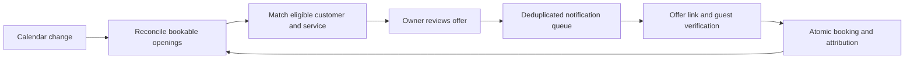

# Gap optimizer review — 16 September 2026

The product idea fits OPUS: help a small beauty studio recover useful appointment time. The current implementation has reusable availability, approval, and notification foundations, but it does not complete the recovery journey. The recommended improvement is a service-aware, rules-based recovery workflow with optional AI wording.

This is a review of the current working tree. Application code, feature flags, provider configuration, and production data were not changed. No scans, customer messages, builds, or tests were run. Findings below come from source inspection; production deployment and provider delivery were not verified.

## What exists

A manual scan inspects today; the backend can also accept another date. A cancellation schedules a scan for the affected staff member and date when the organization has the paid plan and enables the optimizer. Availability calculation considers working rules, overrides, bookings, and breaks. Only free intervals bounded on both sides by bookings or breaks become suggestions.

For each staff member, the ranker selects up to five customers using fixed visit, recency, staff-preference, and no-show weights. It requires marketing opt-in, a preferred channel, at least three recorded visits, and a last-visit value within 180 days. The same candidates are used for every gap for that staff member. Claude writes one message per candidate per gap. A manager or owner can approve outreach, which inserts a notification.

Keep the existing tenant authorization, paid-plan checks, explicit approval boundary, calendar foundations, and notification infrastructure. Change the offer selection and lifecycle as one coherent feature.

## Findings, in implementation priority order

| Priority | Finding | Evidence and consequence |
| --- | --- | --- |
| Critical | The current offer delivery path cannot complete. | `convex/ai/gapOptimizerHelpers.ts:128` queues `gap_fill_offer`. `convex/notifications.ts:689` rejects non-email channels. For email, `appointmentData` requires `startAt`/`endAt`, while the offer supplies `gapStartAt`/`gapEndAt` and no booking; the email switch also has no `gap_fill_offer` renderer (`:349`, `:404`). Provider credentials alone cannot fix this. |
| Critical | Approval is reported as delivery. | `gapOptimizerHelpers.ts:147` sets the candidate to `sent` immediately after queue insertion. `GapList.tsx:168` shows a sent toast. Worker failure never updates the candidate. The dashboard can therefore show successful outreach for a failed notification. |
| High | Approving an old or repeated offer is not guarded. | `approveAndSendCandidate` checks role and ownership, but does not require a proposed candidate, an active unexpired gap, current availability, current consent, active customer/staff, or a usable channel address. Repeated calls create separate notifications. The shared queue already supports dedupe keys (`notifications.ts:104`), but this path bypasses that helper. |
| High | Recovery has no completion or expiration loop. | `filled`, `expired`, `filledByBookingId`, and response states exist in the schema. No writers for these outcomes were found in the booking/recovery code. `getOpenGapsForOrg` returns all open/outreach suggestions without a date or availability filter (`gapOptimizerHelpers.ts:222`). Filled, past, or changed openings can remain actionable. |
| High | Gap detection excludes valuable cancellations. | `slots.ts:753` accepts only interior gaps. Cancelling the first, last, or only appointment can leave an opening that is classified as an edge and ignored. An opening clipped by the current time is also excluded. This is a product choice that conflicts with broad cancellation-recovery claims. |
| High | Recommendations are not matched to a specific service or time. | `rankCandidatesForGap` receives only `orgId` and `staffId` (`gapOptimizerHelpers.ts:10`). It cannot evaluate a customer's usual service, due date, day/time preference, upcoming appointment, or overlapping appointment. The scanner filters services only to estimate value and still drafts when none fit (`gapOptimizer.ts:164`). |
| High | The visit inputs do not consistently mean completed visits. | Dashboard booking creation increments `totalVisits` and sets `lastVisitAt` to creation time (`bookings.ts:202`, `:507`). Public booking creates customers with zero visits (`publicBooking.ts:359`); completion updates spend but not those visit fields (`bookings.ts:566`). Identical attendance histories can rank differently depending on how appointments were entered. |
| High | There is no visible consent/preferences collection path for this feature. | Customer creation defaults marketing consent to false and leaves the preferred channel unset. The update API supports these fields, but no references to them were found in the dashboard/public-site app and component code. Ordinary new customer records therefore fail candidate eligibility until those preferences are populated through another path. Do not solve this by treating a booking as consent. |
| Medium | The displayed match percentage is misleading. | `GapList.tsx:216` displays the message model's `confidenceScore` as customer “Match”. This is separate from the deterministic ranking score and has no calibrated relationship to booking probability. The model receives no evidence from which to estimate customer acceptance. |
| Medium | The message and booking link lack the actual offer. | The prompt includes name, staff, and gap duration, but no date, start time, service, price, business locale, or booking link (`gapOptimizer.ts:186`). Approval constructs `https://opus.mk/{slug}/book` (`gapOptimizerHelpers.ts:126`), whereas the active tenant route uses `https://{slug}.opus.mk/book`. The public form currently accepts service/staff preselection, not an expiring offer or exact time. |
| Medium | Repeated scans spend model calls before checking duplicates. | Every candidate draft is generated before `persistGapAndCandidates` checks an exact start/end duplicate (`gapOptimizer.ts:185`, `gapOptimizerHelpers.ts:382`). Duplicate scans still report drafts as created; changed boundaries can produce overlapping suggestions; dismissed gaps can be recreated. There is no persisted scan lock or budget. |
| Medium | Value and empty states overstate what is known. | `estimateGapRevenue` scales average service price by gap length. A 90-minute gap with only a 60-minute service priced at 1,200 MKD is valued at 1,800 MKD, although only one such appointment fits. The widget treats `openCount === 0` as “Zero Gaps”, including when outreach remains unresolved or nothing has been scanned. The summary uses the UTC date while scanning uses the business timezone (`gapOptimizerHelpers.ts:274`). |

A free interval is also not necessarily a public-bookable offer. Public booking applies service assignment, allowed slot starts, a lead-time cutoff, and a booking window. The optimizer must share those rules and buffer semantics with booking. Reusing interval subtraction alone leaves differences between advertised openings and what a customer can confirm.

The current `automatedGapOptimizer` capability is true, while `docs/PRODUCT_SCOPE.md` still lists automated gap analysis/campaigns as deferred. This review records that mismatch and does not change either boundary. A future implementation should deliberately document the approved manual recovery scope and distinguish it from autonomous campaigns.

## Recommended behavior

The unit of recommendation should be a concrete offer: **customer + service + staff member + valid start/end + actual price**. A free block can contain alternative offers, but their values must not be added together as if every alternative can sell.

1. **Find a useful, bookable opening.** Start with cancellation recovery and a configurable near-term horizon. Include openings at the edges of a day. Use the same service availability and conflict rules as public booking. Keep actual service duration, buffers, minimum notice, working hours, and booking window in the decision. An entirely empty day can be shown as open capacity without generating dozens of outreach items.
2. **Apply hard eligibility rules.** Require an active customer, permission for the intended outreach channel, a usable address, and an operational delivery route. Exclude overlapping appointments, an existing upcoming booking for the same need, recent outreach, and declined offers. Repeat these checks at approval and immediately before delivery.
3. **Rank using customer intent and completed appointment history.** Prioritize an explicit waitlist request for this service/time when that workflow exists. Next consider customers due to return for the relevant service, then observed staff and day/time preference. Derive visit history from completed appointments, counting a combined-service visit once. Recent contact is not evidence that someone needs another treatment.
4. **Show reasons a studio owner can inspect.** For example: “Usually books a manicure every four weeks; last completed visit was 29 days ago; usually chooses Elena; no upcoming manicure.” Label missing history as unknown. Use an ordinal recommendation label or a clearly named rules score initially; do not show a probability without outcome-based calibration.
5. **Prepare a complete local-language offer.** A template supplies verified studio, service, date/time, price, and an expiring booking link. Optional AI can adjust the wording after selection. A template must remain usable when the model fails. The model should not determine availability, price, or customer eligibility.
6. **Require owner/manager approval and contact in controlled waves.** Start with one appropriate recipient per opening. Let staff choose whether to try the next candidate after expiry/decline. Apply a customer-wide cooldown so the same person is not contacted for every staff member and opening. Do not automatically send a second wave in the first release.
7. **Close the loop through booking.** Resolve the offer on the tenant website, preserve the existing guest email verification, and atomically recheck availability when confirming. Two acceptances for the same slot must produce at most one booking. Invalidate competing offers when the opening is occupied, and show alternatives for expired or unavailable offers.

There is no implemented waitlist in the inspected Convex schema/functions. Adding one is a useful second step, not an existing capability to depend on. Capture the requested service, optional staff, acceptable dates/times, minimum notice, channel consent, and expiry. A customer explicitly asking for an opening is a stronger starting signal than a generic “regular customer” score; this is a design hypothesis to measure, not a claimed conversion result.

For studios with little history, use explicit requests and owner selection. A mandatory three-visit threshold prevents a new studio from getting value. As completed history grows, use service-specific return intervals with conservative fallbacks; do not invent certainty from one or two visits.

Example proposed UI, using hypothetical data:

> **Tomorrow, 14:00–15:00 · Elena · Manicure · 1,200 MKD**  
> Ana is due for her usual manicure and has no upcoming appointment.  
> Actions: **Review message**, **Choose another client**, **Dismiss**.  
> After approval: **Queued**, then **Provider accepted** / **Failed**, followed separately by **Booked** / **Expired**.

## Implementation shape

- **Shared availability:** extract/reuse pure domain helpers for slot and interval semantics. Public booking and recovery must agree. Existing booking timestamps encode local wall time as UTC-shaped values; use `convex/lib/bookingTime.ts` for real expiry/scheduling instants instead of comparing those values directly to `Date.now()`.
- **Persisted opportunities:** reconcile by tenant, staff, date, and schedule revision. Retain dismissed decisions for unchanged openings; invalidate or update obsolete opportunities after booking, cancellation, rescheduling, working-hours, and service changes. Claim scan work and deduplicate before invoking AI. Start with bounded work for small studios.
- **Persisted offers:** include the concrete service/time/price snapshot, customer, expiry, reason codes, rank version, notification reference, and an opaque offer token. Keep token-to-customer resolution server-side; a link must not expose other customers or bypass guest verification. Preserve existing rows through compatible additions or explicit migration.
- **Separate states:** track opportunity state, offer response, and delivery state separately. Queue insertion means queued; provider acceptance means sent; a verified webhook can establish delivery. Booking state comes only from the booking mutation. Delivery failure must remain visible and retryable where appropriate.
- **Transactional boundaries:** approval atomically revalidates eligibility and enqueues one notification using a stable dedupe key. Confirmation atomically checks conflicts, writes the booking, and records offer attribution. A worker checks current eligibility before attempting external delivery. A provider call cannot be made atomic with the database; use claims, stable provider idempotency, bounded retries, and reconciliation for failures. Convex documents that separate action query/mutation calls use separate transactions and scheduled actions are not automatically retried: [actions](https://docs.convex.dev/functions/actions), [scheduled functions](https://docs.convex.dev/scheduling/scheduled-functions).
- **Tenant isolation:** new queries/indexes include `orgId`; validate ownership of related records, require the appropriate staff role, and append audit entries for approvals, dismissals, sends, and conversions. Customer data and ranking evidence remain within the studio.
- **Metrics:** report opportunities, queued offers, provider failures, attributed bookings, and completed appointment value. Keep potential offer value distinct from booked and completed value. An ordinary booking overlapping a gap closes it but does not automatically prove outreach caused it. Moving an existing appointment is not automatically additional revenue.

## Delivery order

**First release: reliable manual recovery.** Fix the delivery/template/link and state issues; use concrete bookable service offers, current eligibility, completed-visit data, deterministic localized messages, approval deduplication, expiry, and offer attribution. Replace the false match percentage and “Zero Gaps” assumptions with explicit reasons and scan state. Keep existing pages and paid access while replacing the backend contract coherently.

**Second release: explicit demand.** Add the waitlist/preferences collection flow and improve service-specific return timing. Show which signals are missing and let owners select an eligible customer when history is sparse. Expand beyond cancellation recovery only after the first journey works reliably.

**Later: learn from measured outcomes.** Add acceptance/completion prediction only when there is enough relevant data to evaluate it against the rules baseline. Optimize for useful completed appointments and acceptable contact frequency. Offer-linked bookings measure attribution; proving additional bookings requires a controlled comparison. Avoid introducing an autonomous campaign engine as part of this initial repair.

Future implementation verification should cover: first/last/only-appointment cancellation; slot-grid/buffer and timezone edges; stale/filled/expired suggestions; no fitting service; revoked consent or missing address; duplicate approval and overlapping scans; provider failure and repeated delivery; concurrent acceptance; public and manual completed-visit histories; and offer attribution without counting reschedules or alternatives as new value. Existing optimizer-specific tests found in this review cover paid access, not this recovery journey. These are proposed checks, not tests run during this review.
