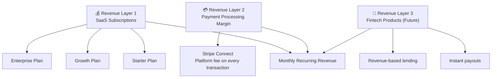
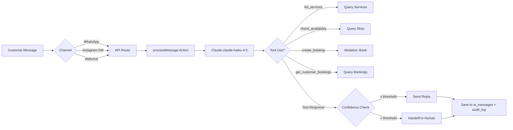
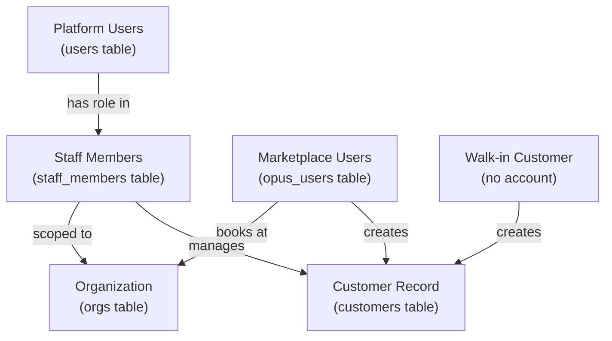

# OPUS — Project Overview & Business Model

> **Purpose**: This document provides a comprehensive overview of the OPUS platform for AI assistants and developers. Use it as context when asking questions about the project's architecture, features, or future development.

---

## 1. What is OPUS?

**OPUS** is a **multi-tenant, white-label SaaS platform** — a Business Operating System for service-based businesses. It targets two industry verticals:

| Vertical | Examples | Status |
|---|---|---|
| **Beauty & Wellness** | Barbershops, hair salons, nail studios, spas, tattoo studios, personal trainers | ✅ Primary vertical, mostly built |
| **Hospitality** | Restaurants, cafes, bars, clubs, hotels | 🟡 Schema + onboarding built, dashboard in progress |

Each business that signs up gets their own **branded experience** — custom subdomain (e.g. `king-cuts.opus.mk`), custom domain support (`book.kingcuts.com`), custom color scheme, and optionally their own mobile app.

**Geographic focus**: Initially targeting **North Macedonia** (Skopje), with localization for Macedonian language (MKD currency, Cyrillic AI responses).

---

## 2. Revenue Model — Three Layers



| Layer | Description | Status |
|---|---|---|
| **SaaS Subscriptions** | 3 tiers — Starter / Growth / Enterprise. Schema has `plan` and `planStatus` fields with trialing support | 🟡 Schema ready, billing UI not yet built |
| **Payment Processing** | Stripe Connect with split payouts. Platform takes a cut of every transaction | 🟡 Schema + webhook handlers built, Braintree also integrated as alternative |
| **Fintech (Future)** | Instant payouts, revenue-based lending via Stripe Treasury | 📋 Planned |

---

## 3. Monorepo Architecture

Three independent Next.js apps sharing a single Convex backend:

```
opus/
├── opus-dashboard/        # B2B — Business owner dashboard
│   ├── app/
│   │   ├── (dashboard)/   # Authenticated owner/staff UI
│   │   │   ├── beauty/    # Beauty & wellness vertical
│   │   │   ├── hospitality/ # Hospitality vertical
│   │   │   └── (shared)/  # Cross-vertical: settings, AI inbox
│   │   ├── onboarding/    # Multi-step business setup wizard
│   │   ├── login/signup/  # Clerk auth pages
│   │   └── api/           # Webhooks (Stripe, Instagram, chat)
│   ├── convex/            # ← SINGLE BACKEND (all DB logic lives here)
│   └── components/        # Dashboard UI components
│
├── opus-mk/               # B2C — Public marketplace
│   ├── app/
│   │   ├── page.tsx       # Discovery feed (search, filter by category)
│   │   └── [slug]/        # Business profile + booking flow
│   │       ├── page.tsx   # Profile page (services, gallery, map, reviews)
│   │       └── book/      # Booking flow (date/time → customer details → confirm)
│   ├── convex → symlink to ../opus-dashboard/convex
│   └── components/        # ChatWidget, BusinessMap, etc.
│
└── opus-landing-page/     # Marketing site (no backend)
```

### Tech Stack

| Layer | Technology |
|---|---|
| **Backend / DB** | Convex (real-time DB, mutations, queries, actions, scheduled jobs, cron) |
| **Frontend** | Next.js 16 (App Router, PPR) |
| **Auth** | Clerk (session-based, org-scoped) |
| **Payments** | Stripe Connect (primary) + Braintree (secondary) |
| **AI** | Anthropic Claude (claude-haiku-4-5 for AI agent, claude-sonnet-4-6 for advanced tasks) |
| **Messaging** | Twilio (SMS/WhatsApp), Resend (email) |
| **Maps** | Mapbox GL |
| **Styling** | Tailwind CSS v4, shadcn/ui |
| **Deployment** | Docker → Hetzner VPS via GitHub Actions |

---

## 4. Feature Inventory

### 4.1 opus-dashboard (B2B Dashboard)

#### Beauty & Wellness Vertical

| Feature | Route/Module | Status |
|---|---|---|
| **Dashboard Home** | `/beauty` | ✅ Built — KPI cards, daily schedule, weekly revenue chart, upcoming bookings |
| **Bookings Management** | `/beauty/bookings` | ✅ Built — list, create, calendar view |
| **New Booking Page** | `/beauty/bookings/new` | ✅ Built — multi-step booking form |
| **Staff Management** | `/beauty/staff` | ✅ Built — add/edit staff, profiles, specialties |
| **Staff Detail** | `/beauty/staff/[staffId]` | ✅ Built — individual staff view |
| **Services Management** | `/beauty/services` | ✅ Built — categories, pricing, duration, staff assignment |
| **Finances** | `/beauty/finances` | ✅ Built — revenue stats, payment tracking |
| **Availability Rules** | `convex/availability.ts` | ✅ Built — recurring weekly schedules with breaks |
| **Availability Overrides** | `convex/availabilityOverrides.ts` | ✅ Built — day-off, custom hours per date |

#### Hospitality Vertical

| Feature | Route/Module | Status |
|---|---|---|
| **Dashboard Home** | `/hospitality` | ✅ Built — reservation overview |
| **Floor Plan Builder** | `/hospitality/floor-plan` | ✅ Built — drag-drop table placement (Konva canvas) |
| **Reservations** | `/hospitality/reservations` | ✅ Built — create, manage, status lifecycle |
| **Table Management** | `convex/hospitality/tables.ts` | ✅ Built — shapes, capacity, status tracking |
| **Smart Table Assignment** | `convex/hospitality/findBestTable.ts` | ✅ Built — auto-assigns best table for party size |
| **Reservation Settings** | `convex/hospitality/reservationSettings.ts` | ✅ Built — booking window, party sizes, slot intervals |

#### Shared Features (Cross-Vertical)

| Feature | Route/Module | Status |
|---|---|---|
| **Settings Page** | `/settings` | ✅ Built — tabbed UI (General, Booking Rules, Deposits, Surge Pricing, Notifications, AI, Domain, Branding, Location) |
| **AI Inbox** | `/ai-inbox` | ✅ Built — view AI conversations, handoffs |
| **Customer CRM** | `convex/customers.ts` | ✅ Built — customer profiles, visit history, spend tracking, no-show risk |
| **Customer Notes** | `convex/schema:customer_notes` | ✅ Schema ready |
| **Notification System** | `convex/notifications.ts` | ✅ Built — queued outbound SMS, email, WhatsApp with scheduling |
| **Dashboard Notifications** | `convex/dashboardNotifications.ts` | ✅ Built — in-app bell notifications for new bookings, cancellations |
| **Audit Log** | `convex/auditLog.ts` | ✅ Built — append-only log of all significant mutations |
| **Onboarding Wizard** | `/onboarding` | ✅ Built — 5-step flow (Industry → Identity → Location → Hours → Profile/Setup) |
| **Listing Readiness** | `convex/listing.ts` | ✅ Built — blocking/recommended checklist for marketplace publishing |
| **White-Label Routing** | `app/proxy.ts` | ✅ Built — subdomain + custom domain resolution |

#### Analytics (Dashboard Queries)

| Metric | Backend | UI |
|---|---|---|
| Daily schedule (timeline view) | ✅ | ✅ |
| Revenue stats (period-based) | ✅ | ✅ |
| Booking stats (total, cancelled, no-show rates) | ✅ | ✅ |
| Weekly comparison (WoW, MoM) | ✅ | ✅ |
| Revenue by staff | ✅ | ✅ |
| Staff utilisation | ✅ | ✅ |
| Top services | ✅ | ✅ |
| Customer insights (new, returning, churn risk) | ✅ | ✅ |
| Top customers (by spend) | ✅ | ✅ |
| AI performance (conversations, handoff rate, booking rate) | ✅ | ✅ |
| Weekly revenue chart (current vs previous week) | ✅ | ✅ |
| Notification log (paginated) | ✅ | ✅ |

---

### 4.2 opus-mk (B2C Marketplace)

| Feature | File/Route | Status |
|---|---|---|
| **Discovery Feed** | `/` (page.tsx) | ✅ Built — search, category filter (11 beauty categories), business cards with ratings |
| **Business Profile Page** | `/[slug]` | ✅ Built — cover photo, gallery, bio, services list, location map, ratings/reviews, contact pills |
| **Booking Flow** | `/[slug]/book` | ✅ Built — service selection → date/time picker → customer details → confirmation |
| **AI Chat Widget** | ChatWidget component | ✅ Built — floating webchat with AI front-desk, shows on business profiles |
| **Mapbox Integration** | BusinessMap component | ✅ Built — interactive map on business profiles |
| **Review Display** | Profile page | ✅ Built |
| **User Accounts** | `opus_users` table | 🟡 Schema ready, login flow not yet wired |
| **Loyalty Program** | `opus_users.opusPoints` | 📋 Schema has fields (points, tier: bronze/silver/gold), not implemented |

---

### 4.3 AI Front-Desk Agent

The AI system is one of the key differentiators:



| AI Feature | Status |
|---|---|
| Multi-turn conversation with tool use | ✅ Built |
| Tools: list_services, check_availability, create_booking, get_customer_bookings | ✅ Built |
| Confidence scoring with auto-handoff | ✅ Built |
| Working hours enforcement (away messages) | ✅ Built |
| Macedonian language support with vocabulary enforcement | ✅ Built |
| Configurable persona, tone, system prompt, greeting | ✅ Built |
| Webchat channel | ✅ Built |
| Instagram DM channel | ✅ API route exists |
| WhatsApp channel | 📋 Schema ready |
| Voice AI (Vapi/Retell) | 📋 Planned |

---

### 4.4 Payments & Payouts

| Feature | Status |
|---|---|
| Stripe Connect integration | ✅ Schema + webhook handlers |
| Braintree as alternative processor | ✅ Client token, deposit initiation |
| Payment intent lifecycle (webhook-driven) | ✅ Built |
| Payout splits (staff / owner / platform) | ✅ Schema + logic |
| Deposit requirements (fixed or percentage) | ✅ Built |
| Surge pricing rules | ✅ Built |

---

## 5. Database Schema Overview

**28 tables** organized by domain:

| Domain | Tables |
|---|---|
| **Multi-tenancy** | `orgs`, `org_settings`, `org_media` |
| **Identity** | `users`, `staff_members`, `staff_invites`, `opus_users` |
| **Catalogue** | `service_categories`, `services` |
| **Scheduling** | `availability_rules`, `availability_overrides`, `bookings` |
| **Payments** | `payment_intents`, `payout_splits`, `payouts` |
| **CRM** | `customers`, `customer_notes` |
| **Marketplace** | `reviews` |
| **AI** | `ai_conversations`, `ai_messages` |
| **Ops** | `notifications`, `dashboard_notifications`, `audit_log` |
| **Hospitality** | `floor_plans`, `tables`, `reservation_settings`, `reservations` |

### Core Design Principles
- Every table is partitioned by `orgId` (multi-tenancy boundary)
- Soft deletes only (`isDeleted` + `deletedAt`)
- Money in minor units as integers (never floats)
- Timestamps as Unix milliseconds
- Append-only audit log
- Named indexes for all queries (no table scans)

---

## 6. User Types



| User Type | Table | Has Clerk Account? | Scope |
|---|---|---|---|
| **Business Owner/Staff** | `users` → `staff_members` | ✅ Yes | Per-org (via `staff_members` join) |
| **Marketplace Consumer** | `opus_users` | ✅ Yes (future) | Global — can book across businesses |
| **Customer (CRM)** | `customers` | ❌ No | Per-org — staff-managed records |

Roles within an org: `owner` → `manager` → `staff`

---

## 7. What's NOT Built Yet (Future Development Areas)

> [!IMPORTANT]
> These are identified gaps based on code and schema analysis — not a roadmap.

### High Priority (Schema/Code references exist)

| Area | Evidence | Notes |
|---|---|---|
| **Subscription billing UI** | `orgs.plan`, `planStatus`, `trialEndsAt` | Schema exists, no Stripe billing integration or plan selection UI |
| **OPUS mobile app** | `booking.source: "opus_app"`, AGENTS.md mentions React Native/Expo | No mobile code in repo |
| **opus_users login flow** | `opus_users` table, `clerkId` field | Schema ready but no auth flow on opus-mk |
| **Review submission UI** | `reviews` table fully modeled | Backend queries exist, no submission form on opus-mk |
| **WhatsApp AI channel** | `ai_conversations.channel: "whatsapp"` | Schema + conversation model ready, no Twilio webhook |
| **Hospitality: Menu management** | Nav has "Menu" link for hospitality | Route exists in nav config, no page built |
| **Hospitality: Staff page** | Nav has "Staff" link for hospitality | Route exists in nav config, no page built |
| **Hospitality: Finances page** | Nav has "Finances" link for hospitality | Route exists in nav config, no page built |

### Medium Priority

| Area | Evidence | Notes |
|---|---|---|
| **Loyalty program** | `opus_users.opusPoints`, `tier` (bronze/silver/gold) | Fields exist, no earning/redemption logic |
| **GDPR erasure** | `gdprErasureRequestedAt` on customers + opus_users | Field exists, no erasure workflow |
| **Featured listings** | `orgs.featuredUntil` | Schema field, no payment/feature flow |
| **Voice AI** | AGENTS.md mentions Vapi/Retell | Planned, not started |
| **Custom mobile app per business** | AGENTS.md: "optionally their own mobile app" | Not started |
| **Staff invites** | `staff_invites` table fully modeled | Schema exists, invite flow may be partial |
| **Slot computation refinement** | `dashboard.ts` comments: "placeholder 0 empty slots" | Uses rough estimates for utilisation |

### Lower Priority / Future Fintech

| Area | Notes |
|---|---|
| Instant payouts (via Stripe Treasury) | Mentioned in AGENTS.md |
| Revenue-based lending | Mentioned in AGENTS.md |
| No-show deposit enforcement | `customers.requiresFullDeposit` exists |
| Notification retry logic | Queue exists, retry mechanism TBD |
| Multi-city expansion | Currently hardcoded "Skopje" in opus-mk header |
| Search with RAG AI | CLAUDE.md mentions "RAG AI powers recommendations" |

---

## 8. Key Architecture Decisions

1. **Single Convex backend shared via symlink** — `opus-mk/convex` symlinks to `opus-dashboard/convex`. Both apps read/write to the same DB.

2. **Vertical-aware routing** — Dashboard layout detects `profile.industry` and redirects to the correct vertical module (`/beauty` or `/hospitality`). Shared pages (settings, AI inbox) work across verticals.

3. **AI never directly mutates** — AI actions call Convex Actions (not mutations), which validate and then call mutations. This keeps the audit trail clean.

4. **Listing status is computed, not just set** — `recomputeListingStatus` is called internally whenever relevant data changes. A published listing auto-suspends if a blocking condition breaks.

5. **White-label via hostname** — `proxy.ts` resolves incoming hostname to an `orgId` via the `orgs` table (`by_slug` for subdomains, `by_custom_domain` for custom domains).

6. **Per-org notification queue** — Notifications are never sent directly from mutations. They're written to a queue table and processed by scheduled Convex Actions (prevents timeouts, enables retries).

---

## 9. Copy-Paste Context Block for AI Chat

Use the block below when starting new AI chat sessions about this project:

```
OPUS is a multi-tenant SaaS white-label Business Operating System for service-based
businesses (barbers, salons, spas, restaurants). Three apps in a monorepo:

1. opus-dashboard (Next.js 16 + Convex) — B2B dashboard for business owners.
   Features: bookings, staff/service management, availability scheduling, CRM,
   analytics, AI front-desk inbox, settings, payments (Stripe Connect), hospitality
   module (floor plan builder, reservations, table management).

2. opus-mk (Next.js 16, symlinks to same Convex backend) — B2C marketplace.
   Features: discovery feed with search/category filtering, business profile pages,
   booking flow, AI webchat widget, Mapbox integration.

3. opus-landing-page — Marketing site, no backend.

Tech: Convex (real-time DB), Next.js 16 (App Router), Clerk (auth), Stripe Connect
(payments), Anthropic Claude (AI agent with tool use), Tailwind CSS v4, shadcn/ui.
Deployed via Docker on Hetzner VPS.

Revenue: SaaS subscriptions (Starter/Growth/Enterprise) + payment processing margin
+ future fintech. Currently targeting North Macedonia (MKD currency, Macedonian language).

Key architecture rules: every table has orgId, soft deletes only, money in minor units,
timestamps as Unix ms, AI never directly mutates, append-only audit log.
```

---

*Generated from codebase analysis on 2026-04-14. Cross-reference with the actual code for the latest state.*
